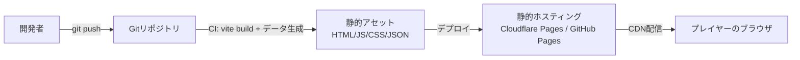
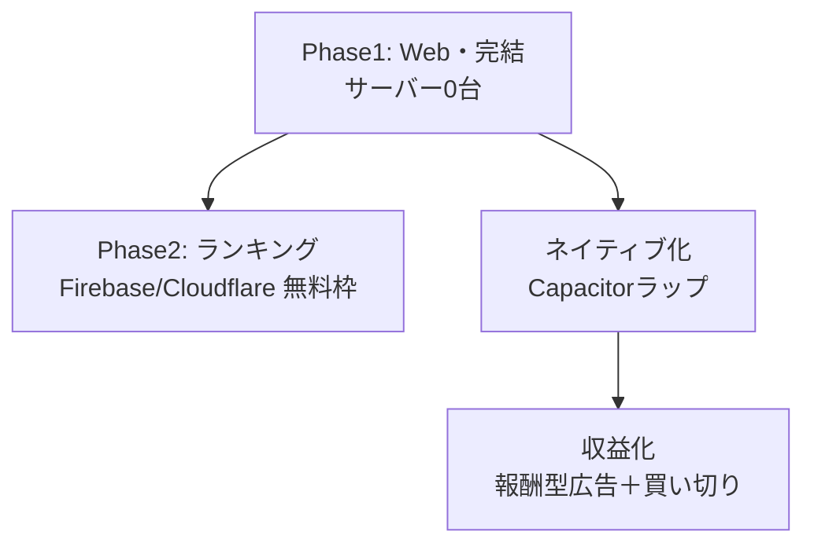

# 技術仕様書 (Architecture Design Document)

**プロダクト**：漢字合体ガチャ（仮称）
**バージョン**：v1.0
**インプット**：`docs/product-requirements.md` v1.0 / `docs/functional-design.md` v1.0
**前提**：クライアント完結・バックエンド無し（MVP）。制約4「運用・セキュリティのリスク／コスト最小」を全判断の軸とする。

---

## 0. 設計上の最重要判断

| 判断 | 結論 | 根拠 |
|---|---|---|
| バックエンド | **持たない（MVP）** | 制約4。判定はクライアント内JSON辞書で完結（機能設計1） |
| UIフレームワーク | **Svelte 5**（後述1.2で詳細） | 極小バンドル・低学習/保守コスト・個人開発に最適 |
| 演出レンダリング | **CSSアニメ＋Canvas 2D** | 依存最小。WebGLエンジンは過剰。必要時にPixiJSを後付け |
| ホスティング | **静的ホスティング（無料枠）** | サーバー0台・運用費0円 |
| 将来のネイティブ | **Capacitorでwebコードを再利用** | Web資産を捨てずにストア配信・収益化に接続（整理書1.4/5.3） |

---

## 1. テクノロジースタック

### 1.1 言語・ランタイム

| 技術 | バージョン | 用途 |
|------|-----------|------|
| TypeScript | 5.x | アプリ全体・型安全（CLAUDE.md準拠、機能設計のドメイン型を直接実装） |
| Node.js | v24.11.0 | ビルド時のみ（開発サーバー・データ生成スクリプト・テスト） |
| npm | 11.x | パッケージ管理（Node同梱・追加導入不要） |

> 実行時はブラウザのみ。Node.jsは**ビルド時専用**で、配信物（静的ファイル）にNodeは含まれない。

### 1.2 フレームワーク・ライブラリ（実行時）

| 技術 | バージョン | 用途 | 選定理由 |
|------|-----------|------|----------|
| Svelte | 5.x | UI・状態管理 | **コンパイル時にフレームワークを消し去り**、実行時ランタイムが極小。仮想DOMのオーバーヘッドが無く、約100KBのデータ＋軽量バンドルという目標（PRD性能）に最適。リアクティブ構文が単純で、個人開発の保守コストが低い。組み込みstoreで状態管理ライブラリを追加せず済む |
| （標準）Canvas 2D / CSS Animations | ブラウザ標準 | ガチャ・合体演出（パーティクル・リング・グロウ） | 依存ゼロ。16方向パーティクル等はCanvas 2D、フラッシュ/シェイク/カラーグロウはCSSで十分。WebGLエンジンは導入コスト・バンドル増に見合わない |

**採用しなかった選択肢**：

| 候補 | 不採用理由 |
|---|---|
| React / Preact | 仮想DOMのランタイムを抱える。本UI規模ではSvelteの方が軽量・単純 |
| Vanilla TS（フレームワーク無し） | 最小だが、Home/Game/Resultの状態遷移とDOM更新の手書きが冗長。Svelteの低コストさが上回る |
| Phaser / PixiJS（ゲームエンジン） | UIはDOM中心（手札・図鑑・ボタン）であり、フルゲームエンジンは過剰。パーティクルのためだけに重い依存を抱えない。**演出のCanvas負荷が問題化した場合のみ**PixiJSを部分導入する（将来判断） |

### 1.3 開発ツール

| 技術 | バージョン | 用途 | 選定理由 |
|------|-----------|------|----------|
| Vite | 5.x | ビルド・開発サーバー・バンドル | Svelte公式サポート。高速HMR。静的出力で無料ホスティングに直結。gzip/brotli圧縮対応（PRDの約100KB目標） |
| Vitest | 2.x | ユニットテスト | Viteと同一設定で動作。ドメイン層（合体判定・スコア・ガチャ抽選・詰み判定）のロジックテストに使用 |
| Playwright | 1.x | E2Eテスト | 主要ブラウザでの一連プレイ・デイリー再現性検証 |
| ESLint + Prettier | 9.x / 3.x | 静的解析・整形 | 品質・一貫性（開発ガイドラインで規約確定） |
| vite-plugin-pwa | 0.x | SW・PWA化 | **MVPで最小構成を有効化**：静的アセット（JS/CSS/辞書JSON）をService Workerでプリキャッシュ（Cache First）し、PRDの「辞書ロード後オフライン動作」を保証する（問題5）。ホーム追加・インストール等のPWA体験強化は後続フェーズ |

### 1.4 データ生成（ビルド時スクリプト）

| 技術 | 用途 |
|------|------|
| Node.js スクリプト（TS） | KANJIDIC2 + KRADFILE → `kanji.json` / `parts.json` / `combine-dict.json` を生成（機能設計8.1）。到達可能字数N・MAX_COMBINE_PARTS・詰み率モンテカルロ検証もここで実行しCIに組み込む |

---

## 2. アーキテクチャパターン

### 2.1 レイヤードアーキテクチャ

機能設計のレイヤー分離を踏襲。依存は**上から下への一方向**のみ。ドメイン層はUI・RNG・ストレージにインターフェース経由で依存し、テスト可能性を担保する。

```
┌─────────────────────────────────────┐
│ UIレイヤー（Svelteコンポーネント）       │ ← 画面・演出・入力
│   Home / Game / Result / Zukan / About │
├─────────────────────────────────────┤
│ アプリケーションレイヤー                │ ← ゲーム進行・状態（Svelte store）
│   SessionManager / store              │
├─────────────────────────────────────┤
│ ドメインレイヤー（純粋ロジック・無依存） │ ← Gacha / Combine / Score / Rescue
├─────────────────────────────────────┤
│ データレイヤー                         │ ← DictionaryRepository / StorageRepository
│   静的JSON辞書ロード / localStorage    │
└─────────────────────────────────────┘
```

**依存ルール**：

| レイヤー | 許可 | 禁止 |
|---|---|---|
| UI | アプリ層の呼び出し、storeの購読 | ドメイン・データ層への直接アクセス |
| アプリ | ドメイン層・データ層の呼び出し | UIへの依存（DOM参照を持たない） |
| ドメイン | 引数で受け取った値・RNGインターフェースのみ | UI・ストレージ・`Date.now`/`Math.random`への直接依存（注入で受ける） |
| データ | fetch（静的JSON）、localStorage | ビジネスロジックの実装 |

> **ドメイン層の純粋性とRNG注入**：`Math.random`・`Date.now` をドメイン層に直書きしない。RNGとタイムスタンプは引数注入する（機能設計4.3/4.6）。**RNGインスタンスはアプリ層（`SessionManager.start`）で生成**し、フリープレイ時は `() => Math.random()` をラップした関数、デイリー時は `mulberry32(dailySeed(todayYmdJst(Date.now())))` を生成してドメイン層に渡す（問題7）。ドメイン層は `RNG` インターフェース型のみ受け取り実装を知らない。これによりデイリーの決定論的再現とユニットテストが成立する。なお `src/` 配下の具体的なディレクトリ構成は repository-structure.md で定義する（提案1）。

### 2.2 状態管理

- **Svelte store** に `GameSession`（機能設計3.2）と永続データのビューを保持
- UIはstoreを購読して再描画。アプリ層が`SessionManager`を通じてstoreを更新
- 演出（Canvas/CSS）は状態変化イベントを契機に発火し、**ロジックをブロックしない**（判定とアニメを分離。PRD性能）

### 2.3 演出アーキテクチャ

| 演出 | 実装 | 備考 |
|---|---|---|
| カプセル降下・振動・開封 | CSS transition / keyframes | 軽量・GPU合成 |
| レアリティ別グロウ/カラー | CSS（box-shadow / filter） | ★1〜★5の5色 |
| 合体成功（フラッシュ・リング2重・16方向パーティクル） | Canvas 2D（単一レイヤー） | パーティクルはオブジェクトプールで再利用しGC負荷を抑制 |
| 失敗（赤シェイク・✕） | CSS animation | 軽量 |
| スコアフロート・読み/意味表示 | DOM | アクセシビリティ確保 |

**演出ループの方針（提案2）**：演出は単一の `requestAnimationFrame` ループで駆動し、アクティブなパーティクル/エフェクトをプール（上限数を設定）で管理する。連続合体成功など演出が同時多発する場合も、プール上限で同時描画数を頭打ちにし60fpsを死守する（超過分は間引き）。

---

## 3. デプロイ・ホスティングアーキテクチャ



| 項目 | 方針 |
|---|---|
| 配信形態 | 完全静的（SSR無し）。`vite build` の出力をそのまま配信 |
| ホスティング候補 | Cloudflare Pages / GitHub Pages / Netlify（いずれも**無料枠**・CDN付き） |
| **Phase1 採用先** | **GitHub Pages**（`GITHUB_TOKEN`/OIDC のみで完結＝外部シークレット不要・運用費0円）。公開URL `https://fuji18.github.io/kanji_gacha/`（T-026） |
| サーバー | **0台**。運用費0円（制約4） |
| CI/CD | push契機でビルド＋データ生成＋テスト＋デプロイ。`ci.yml`（品質ゲート）と `deploy.yml`（`main` push でGitHub Pagesへ配信）に分離 |
| サブパス対応 | プロジェクトページは `/kanji_gacha/` 配信。デプロイ時のみ `DEPLOY_BASE=/kanji_gacha/` で `base` を切替（dev/E2Eは `/`）。`import.meta.env.BASE_URL` 経由で辞書取得が解決（T-012/T-026） |
| 独自ドメイン | 任意（無料枠でも可。apex化すれば `base='/'` に戻せる） |

> **CSP の適用方式（T-026）**：GitHub Pages は `_headers` を解釈しないため、CSP `default-src 'self'` は `index.html` の `<meta http-equiv>` で適用し全配信先で有効にする。`_headers` も併置し、Cloudflare Pages / Netlify へ移行した場合のヘッダ管理を可搬に保つ（6.2）。

---

## 4. データ永続化戦略

### 4.1 ストレージ方式

| データ種別 | ストレージ | フォーマット | 理由 |
|-----------|----------|-------------|------|
| 漢字/部品/合体辞書（読み取り専用マスタ） | 静的アセット（CDN配信） | JSON（gzip/brotli） | ビルド成果物。起動時ロード→`Map`展開でO(1)判定（機能設計9） |
| 図鑑・ベスト・デイリーベスト・設定 | localStorage | JSON文字列（単一キー `kg.state.v1`） | サーバーレス。端末内完結。読み書き集約（機能設計3.3/8.3） |
| セッション状態 | メモリ（Svelte store） | オブジェクト | 1プレイ中のみ。終了時に永続データへ反映 |

### 4.2 バックアップ・移行戦略

- **MVP**：localStorageのみ。明示的バックアップ機構は持たない（サーバーレス徹底）
- **スキーマ移行**：`schemaVersion`（現在1）で順次マイグレーション。フィールド追加はデフォルト補完、破損時は初期化（機能設計5.2/11）
- **将来（P1+）**：ユーザー手動のエクスポート/インポート（JSONダウンロード/読み込み）を**ローカル完結**で追加可能。クラウド同期はスコープ外
- **リスク**：localStorageはブラウザ・端末依存。クリアで図鑑が消える旨をAbout/設定に明示する（UX設計で対応）

---

## 5. パフォーマンス要件

### 5.1 レスポンスタイム

| 操作 | 目標時間 | 測定方法 |
|------|---------|---------|
| 合体判定（辞書検索） | 1ミリ秒以下 | `Map.get` のO(1)。`performance.now`で計測 |
| 詰み判定（canCombineAny） | 5ミリ秒以下 | 手札12・上限5部品で約1,573通りの早期return探索（機能設計4.5） |
| 初回起動（辞書ロード→操作可能） | 2秒以内 | アセット取得＋`Map`展開を計測（中位スマホ・3G以上想定） |
| 画面遷移・ガチャ/合体演出 | 60fps維持 | アニメ中の描画フレーム。Canvasはオブジェクトプールでフレーム内割当を抑制 |

**測定前提（問題4）**：基準端末は **Snapdragon 660クラス以上のAndroid／iPhone SE(第2世代)以降**、対象ブラウザ最新版。詰み判定はメインスレッド同期実行を前提とする。低スペック端末でフレームドロップが観測された場合は、詰み判定を `queueMicrotask` 分割または Web Worker へ退避する（将来判断）。

### 5.2 リソース使用量

| リソース | 上限目安 | 理由 |
|---------|------|------|
| 配信データ（辞書） | JSON圧縮後 約100KB以内 | PRD性能要件。常用2,136字で確定 |
| 初期JSバンドル | 圧縮後 約100KB以内（目標） | Svelte＋自前コード。低速回線でも軽快に |
| メモリ | 数十MB | 辞書`Map`＋セッション。モバイルで余裕 |

**JSバンドルの内訳概算と検証（問題6）**：Svelte 5ランタイム約10〜15KB＋自前ロジック約30〜40KB＋演出コード約10〜20KB（いずれもgzip）＝**約50〜75KB**と推定（辞書JSON約100KBは別枠）。CIでビルド成果物のgzipサイズを計測し、**100KB超過時はコードスプリット／依存削減を実施**する。

---

## 6. セキュリティアーキテクチャ

### 6.1 基本姿勢：攻撃面を持たない

| 項目 | 方針 |
|---|---|
| 外部通信 | ゲームプレイに関する送信を行わない（クライアント完結）。攻撃面・情報漏洩面を持たない |
| 個人情報 | 収集・登録・ログインなし。localStorageは端末内のみ |
| 認証・認可 | 無し（MVPはユーザー概念を持たない） |
| 広告SDK | **MVPでは導入しない**（プライバシー・トラッキング面を増やさない。整理書5.1） |
| 依存ライブラリ | 実行時依存をSvelte中心に最小化し、サプライチェーンリスクを抑制 |

### 6.2 クライアント側の防御

- **CSP（Content-Security-Policy）**：Phase1は `default-src 'self'` 基調。外部スクリプト注入を抑止（ホスティングのヘッダ設定）
  - **将来の移行コスト（問題1）**：Phase2のランキングBE導入時は `connect-src` に外部オリジン（Firebase/Cloudflare等）の追加が、ネイティブ後の広告SDK（AdMob）導入時はスクリプト・画像の外部オリジン許可が必要になる。これはCSPの実質的な緩和であり無視できない設計変更。**CSPは `_headers`（Cloudflare Pages）等で環境別に管理**し、Phase1=最厳格／Phase2=connect-src追加／ネイティブ=広告ドメイン許可、と段階的に開放する前提とする
  - Capacitor環境ではWebViewのCSPスキーム（`capacitor://`/`file://`）がブラウザと異なるため、ネイティブ用CSPは別管理とする
- **入力の扱い**：プレイヤー入力は「部品の選択」程度でテキスト入力が無く、XSS面が小さい。図鑑等は内蔵データのみ描画
- **localStorageの健全性**：読み込み時にスキーマ検証し、不正・破損データはサニタイズ/初期化（機能設計11）

### 6.3 ライセンス・コンプライアンス

- KANJIDIC2 / KRADFILE のクレジットをAbout画面に常設（PRD F10・CC BY-SA 4.0継承）
- 自作合体辞書もCC BY-SAで公開（整理書5.2の安全策）

---

## 7. スケーラビリティ設計

### 7.1 データ増加

- 辞書は常用2,136字で**上限が確定**しており、無制限増加は起きない。図鑑記録もこの範囲
- 「極モード」（常用外）追加時は別アセットを遅延ロードし、初期バンドルを太らせない設計とする

### 7.2 機能拡張性（段階的展開）

整理書4.4の3フェーズに対応する拡張ポイントを設計に内包する。



| 拡張 | 設計上の備え |
|---|---|
| グローバルランキング（P2） | スコア送信は薄いAPI層を**後付け**。ドメイン層は変更不要（クライアント判定のまま）。無料枠BE（Firebase/Cloudflare D1） |
| ネイティブ展開 | **Capacitor**でwebビルドをラップしストア配信。コードベースを再利用（書き直さない） |
| 収益化（ネイティブ後） | Capacitorプラグインで報酬型広告（AdMob）・買い切り（ストアIAP）を追加。決済セキュリティはストアに委譲（整理書5.3）。**有料ガチャは実装しない**（規制回避） |
| デイリー・ピックアップ | シードはクライアント生成（サーバー不要）。将来はサーバー配信のお題IDに切替可能なI/Fにしておく |

**PWAとCapacitorの役割分担（問題2）**：両者は排他ではなく役割が異なる。**PWA**（vite-plugin-pwa）は「ホーム追加・オフラインキャッシュ」を低コストで提供する**Web段階の強化**。**Capacitor**は「ストア配信・ネイティブプラグイン（AdMob/IAP）の接続」が主目的の**ネイティブ段階の手段**。順序は **PWA化を先行**させ（整理書1.4「段階的にネイティブ感を高める」に対応）、**Capacitorはストア配信が具体的ターゲットになった時点で導入**する。

**ネイティブ移行時のデータ移行（提案3）**：Capacitorラップ後の `localStorage` はWebView（`capacitor://`/`file://`）オリジンで動作し、Web版（`https://`）とデータが分離される。Web→アプリ移行で図鑑/ベストが引き継げない問題に備え、ネイティブ版では起動時にエクスポートJSON取り込み導線を用意するか、Capacitor Preferences APIへの移行を検討する（移行時判断）。

---

## 8. テスト戦略

### 8.1 ユニットテスト（Vitest・ドメイン層中心）
- **対象**：`makeKey`正規化、`resolveCombine`（scope/複数解/primary動的選定）、`ScoreService`、`drawPart`分布、`canCombineAny`/`findHint`、`mulberry32`再現性、`resolveRank`、マイグレーション
- **カバレッジ目標**：ドメイン層 90%以上（ロジックの中核）

### 8.2 ビルド時検証（CI）
- 到達可能primary字数Nの算出（図鑑分母の正当性）
- `MAX_COMBINE_PARTS` と辞書実最大値の一致
- **詰み率モンテカルロ**：各レベルの詰み終了率がKPI目標（10〜20%）に収まるか（機能設計8.1）

### 8.3 統合・E2Eテスト（Playwright）
- 一連プレイ：開始→10回ガチャ→合体/ミス→終了（詰み/手札0の両経路）
- デイリー再現性：同一日付で2回起動しガチャ列一致（JSTシード）
- 永続化：図鑑追加→リロード→保持、ベスト更新
- 対象ブラウザ：Chrome / Safari / Firefox / Edge 最新（PRD動作環境）

---

## 9. 技術的制約

### 9.1 環境要件
- **対象ブラウザ**：モダンブラウザ最新版（Chrome / Safari / Firefox / Edge）
- **対象デバイス**：スマートフォン（縦持ち）主、PC副（PRD）
- **オフライン**：MVPで vite-plugin-pwa の最小SW（静的アセットのCache Firstプリキャッシュ）を有効化し、初回ロード後の**完全オフライン動作を保証**（PRD非機能要件・問題5）。ホーム追加/インストール等のPWA体験強化は後続フェーズ（F18）
- **外部依存**：実行時の外部サービス依存なし

### 9.2 パフォーマンス制約
- 合体判定1ms以下／起動2秒以内／辞書圧縮後約100KB以内（PRD・第5章）
- 演出は60fps維持。低スペック端末向けにモーション軽減設定を用意（UI設計）

### 9.3 セキュリティ制約
- ゲームプレイの外部送信を行わない／個人情報を扱わない／MVPで広告SDKを入れない

---

## 10. 依存関係管理

### 10.1 バージョン管理方針

```json
{
  "dependencies": {
    "svelte": "^5.0.0"
  },
  "devDependencies": {
    "vite": "^5.0.0",
    "typescript": "~5.x",
    "vitest": "^2.0.0",
    "@playwright/test": "^1.0.0",
    "eslint": "^9.0.0",
    "prettier": "^3.0.0"
  }
}
```

**方針**：
- **実行時依存を最小化**（理想はSvelteのみ）。依存追加は「自作コスト vs リスク」を都度判断
- 安定版は `^`（マイナーまで自動）、破壊的変更リスクがあるものは固定
- devDependenciesはパッチ自動（`~`）を基本
- `package-lock.json` で厳密固定。CIで再現ビルド

### 10.2 追加判断のガード
- 演出のためのゲームエンジン（PixiJS等）は、**Canvas 2Dで性能が出ないと実測で判明した場合のみ**導入
- 状態管理ライブラリは導入しない（Svelte store で足りる）

### 10.3 コードルールによる強制（CI）
- **ドメイン層の純粋性を機械的に強制**：ESLint `no-restricted-syntax`（ASTセレクタ）を `src/domain/**` に適用し、`Math.random()` と `Date.now()` の**メソッド呼び出し**をCIエラーにする。`no-restricted-globals` は `Math`/`Date` 識別子そのものを禁じ `Math.floor` 等まで巻き込むため使わない。乱数・時刻は必ず注入で受ける（2.1・機能設計4.6）。設定例は repository-structure.md 5.2 / development-guidelines.md 6.3
- **import境界の強制**：ドメイン層がUI/データ層をimportしないことを ESLint `no-restricted-imports` ＋循環依存検出（`import/no-cycle`）で検査する

---

## 11. アーキテクチャ決定記録（ADR・要約）

| # | 決定 | 代替案 | 理由 |
|---|---|---|---|
| ADR-1 | バックエンドを持たない | BaaS常時利用 | 制約4。判定はクライアント完結で成立 |
| ADR-2 | UIはSvelte 5 | React/Preact/Vanilla/Phaser | 極小バンドル・低保守コスト・UIはDOM中心 |
| ADR-3 | 演出はCanvas2D＋CSS | WebGLエンジン | 依存最小。必要時のみPixiJSを部分導入 |
| ADR-4 | 静的ホスティング（無料枠） | サーバー運用 | 運用費0円・CDN・スケール自動 |
| ADR-5 | 将来ネイティブはCapacitor | フルネイティブ再実装 | Web資産再利用で低コスト・収益化に接続 |
| ADR-6 | 有料ガチャを実装しない | 課金ガチャ | 景表法・未成年炎上の地雷回避（整理書5/6.3） |
