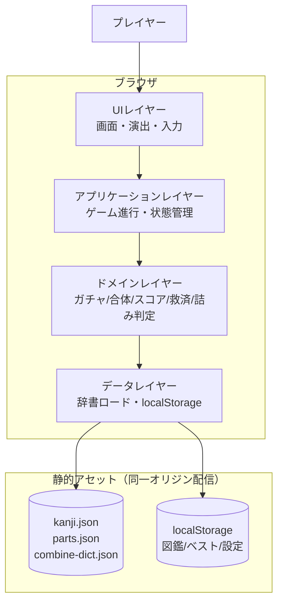
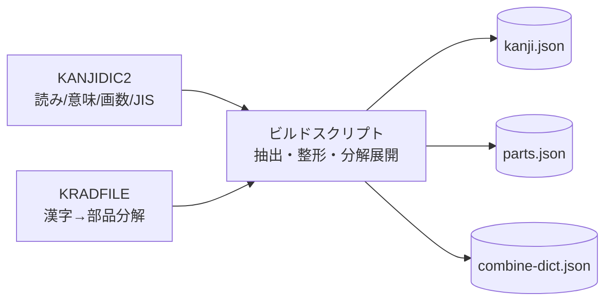
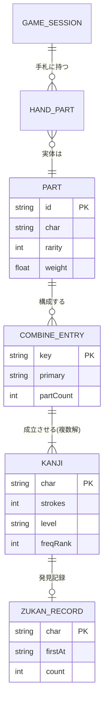
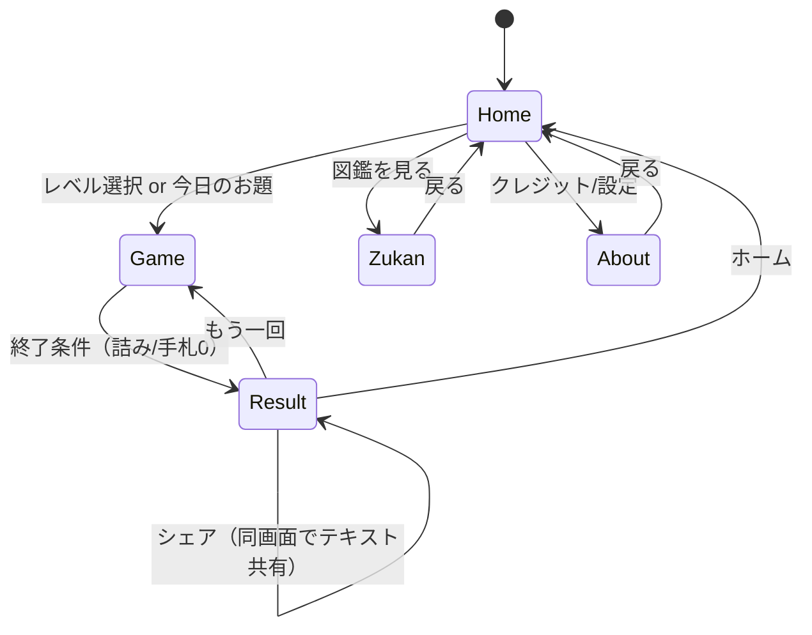
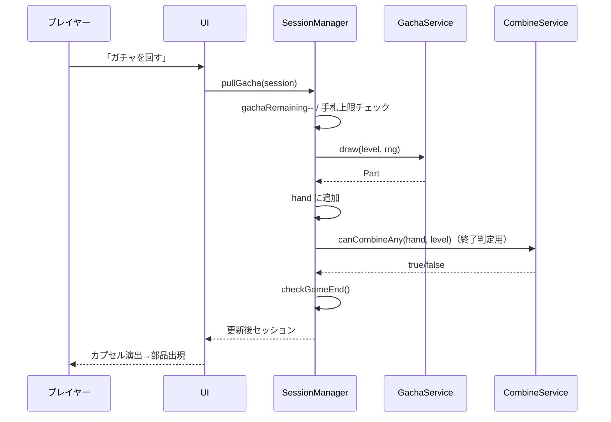
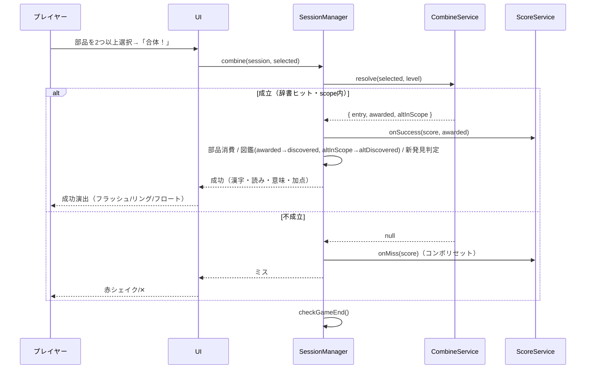
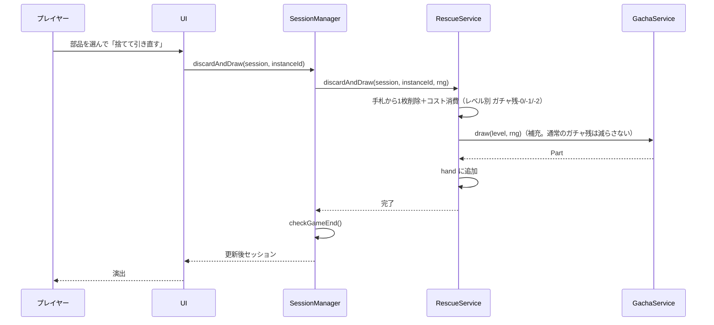

# 機能設計書 (Functional Design Document)

**プロダクト**：漢字合体ガチャ（仮称）
**バージョン**：v1.0
**インプット**：`docs/product-requirements.md` v1.0
**対象範囲**：本書はMVP（P0機能：F1〜F10）の実現方式を定義する。P1以降は構造のみ言及する。

---

## 1. システム構成図

クライアント完結型のWebアプリ。サーバー通信を持たず、すべてブラウザ内で完結する（PRD非機能要件・セキュリティに準拠）。



**ビルド時パイプライン**（実行時には存在しない。アセット生成のみ）：



---

## 2. 技術スタック

| 分類 | 技術 | 選定理由 |
|------|------|----------|
| 言語 | TypeScript 5.x | 型安全・データモデルの明確化（CLAUDE.md準拠） |
| 実行環境 | モダンブラウザ（Chrome/Safari/Firefox/Edge最新） | PRD動作環境。サーバー不要 |
| UI | （要選定：軽量フレームワーク or 素のDOM＋Canvas） | アーキテクチャ設計書で確定。演出はCanvas/CSSアニメ前提 |
| 状態管理 | アプリ内ステート（外部依存最小） | クライアント完結・低依存 |
| 永続化 | localStorage | サーバーレス。図鑑・ベスト・設定の保存 |
| データ形式 | JSON（圧縮配信） | 内蔵辞書。圧縮後約100KB以内（PRD性能要件） |
| ビルド | Node.js v24（CLAUDE.md）＋データ生成スクリプト | KANJIDIC2/KRADFILEからアセット生成 |
| バックエンド | なし（MVP） | コスト・セキュリティ最小（制約4） |

> UIフレームワークの最終選定はアーキテクチャ設計書（architecture.md）で行う。本書はUI技術に依存しないドメイン設計を定義する。

---

## 3. データモデル定義

### 3.1 静的マスタ（ビルド成果物）

```typescript
// 部品マスタ（parts.json）：KRADFILEのラジカルを基盤
interface Part {
  id: string;          // 部品ID（例: "ki", "kuchi"）
  char: string;        // 表示文字（例: "木", "口"）
  rarity: Rarity;      // ★1〜★5
  // どのレベルのプールに属するか（汎用度の指標も兼ねる）
  scopes: Level[];     // 例: ["elementary","juniorhigh","joyo"]
  weight: number;      // プール内サンプリング重み（床保証の主役。後述4.3）
}

type Rarity = 1 | 2 | 3 | 4 | 5;
type Level = 'elementary' | 'juniorhigh' | 'joyo'; // やさ / ふつう / むず

// 漢字マスタ（kanji.json）：KANJIDIC2由来
interface KanjiEntry {
  char: string;        // 漢字（例: "詩"）
  strokes: number;     // 画数（スコア基礎点。PRD F4）
  readings: string[];  // 読み（音・訓）
  meanings: string[];  // 意味（日本語1行表示用）
  level: Level;        // 学年区分（elementary ⊂ juniorhigh ⊂ joyo）
  freqRank?: number;   // 頻度順位（代表解の選定・低いほど一般的）
}

// 合体辞書（combine-dict.json）：KRADFILEから展開
// key = 構成部品idを昇順ソートして "+" 連結（配置不問・重複可のマルチセット）
// 例: ["ki","ki"] -> "ki+ki" -> ["林"]、["hi","tsuki"] -> "hi+tsuki" -> ["明","朙"]
type CombineKey = string;

interface CombineEntry {
  key: CombineKey;     // 正規化済みの部品キー
  results: string[];   // 成立する漢字（複数解。char参照）
  primary: string;     // 代表解（複数解時に優先表示・採点する1字。後述4.4）
  partCount: number;   // 構成部品数（詰み判定の探索上限算出に使用）
}
```

**制約**:
- `CombineKey` は部品idの**マルチセットを昇順ソート**して生成する（配置 ⿰⿱ 不問・同一部品の重複可）
- `results` は1要素以上。複数解は同一keyに複数漢字をぶら下げる
- `KanjiEntry.level` は包含関係（`elementary ⊆ juniorhigh ⊆ joyo`）を満たす。レベル判定はこの単一フィールドで行う
- 常用外（JIS第二水準の難読等）は**ビルド時に除外**する（PRDスコープ外。極モードは将来）

### 3.2 実行時ステート（メモリ）

```typescript
interface GameSession {
  level: Level;
  mode: 'free' | 'daily';
  seed: number | null;        // dailyの場合は dailySeed(todayYmdJst(...)) の整数値（4.6）。freeはnull
  gachaRemaining: number;     // 残りガチャ回数（初期10・暫定）
  hand: HandPart[];           // 手札（上限12・暫定）
  score: ScoreState;
  createdKanji: string[];     // このセッションで作った漢字（重複可）
  newlyDiscovered: string[];  // 今回新規に図鑑追加された漢字
  stats: PlayStats;           // 計測ログ（KPI集計用）
  phase: 'playing' | 'ended';
}

// 手札内の部品インスタンス（同じ部品を複数枚持てるため、instanceで区別）
interface HandPart {
  instanceId: string;  // 手札内の一意ID
  partId: string;      // Part.id 参照
}

interface ScoreState {
  score: number;            // 累計スコア
  comboMultiplier: number;  // 現在のコンボ倍率（1.0/1.5/2.0/3.0・暫定）
  comboCount: number;       // 連続成功数
}

// KPI集計用ログ（PRD測定方法に対応。ローカルのみ・送信なし）
interface PlayStats {
  combineSuccess: number;   // 合体成功回数
  combineMiss: number;      // ミス回数
  hintUsed: number;         // ヒント利用回数
  discardUsed: number;      // 捨てる利用回数
  endReason: 'stuck' | 'empty_hand' | null; // 詰み / 手札0（PRD詰み終了率の定義）
  finalScore: number;
  newDiscoveries: number;
  durationMs: number;
}
```

### 3.3 永続データ（localStorage）

```typescript
interface PersistedState {
  zukan: ZukanState;
  bestScores: Record<Level, number>;        // レベル別ベスト
  dailyBest: Record<string /*YYYYMMDD*/, number>;
  settings: Settings;
  schemaVersion: number;                    // マイグレーション用
}

interface ZukanState {
  // char -> 初回発見日時・累計作成回数（採点・コンプ対象は primary 漢字）
  discovered: Record<string, { firstAt: string; count: number }>;
  // 複数解の非primary字（別解）。MVPでは表示しないがスキーマ予約（将来の別解コレクション用・問題1案B）
  altDiscovered: Record<string, { firstAt: string; count: number }>;
}

interface Settings {
  hintAlwaysOn: boolean;   // やさしいでの常時ヒント等
  // 音・モーション軽減など（UI設計で拡張）
}
```

### 3.4 エンティティ関連（ER図）



---

## 4. アルゴリズム設計

本ゲームの中核。PRDの設計原則「難易度はガチャプールで制御する」を、4.3のガチャ抽選で実装する。

### 4.1 合体判定（F2）

**目的**：選択された部品集合が、現在のレベルで有効な漢字を成立させるか判定し、成立時は採点対象の漢字を返す。

**ロジック**：

```typescript
interface CombineResolved {
  entry: CombineEntry;
  awarded: KanjiEntry;      // 採点・図鑑付与の対象（scope内で動的選定したprimary）
  altInScope: KanjiEntry[]; // scope内の別解（awarded以外）。altDiscoveredへ記録（問題1）
}

function resolveCombine(
  selected: HandPart[],
  level: Level,
  dict: Map<CombineKey, CombineEntry>,
  kanji: Map<string, KanjiEntry>
): CombineResolved | null {
  if (selected.length < 2) return null;            // 2部品未満は不成立
  const key = makeKey(selected);                   // 部品idを昇順ソートして連結
  const entry = dict.get(key);
  if (!entry) return null;                          // 辞書に無い → ミス
  // レベルscope内に成立する漢字
  const inScope = entry.results
    .map(c => kanji.get(c)!)
    .filter(k => isInScope(k.level, level));
  if (inScope.length === 0) return null;            // 範囲外の漢字のみ → ミス扱い
  // scope内から採点対象を動的に確定（問題2）。事前計算のprimaryがscope外でも破綻しない
  const awarded = selectPrimary(inScope);           // 4.4の共通ルールをinScopeに適用
  const altInScope = inScope.filter(k => k.char !== awarded.char);
  return { entry, awarded, altInScope };
}

// 配置不問・重複可：マルチセットを正規化
function makeKey(parts: HandPart[]): CombineKey {
  return parts.map(p => p.partId).sort().join('+');
}

// 学年包含：elementary(0) ⊆ juniorhigh(1) ⊆ joyo(2)
function isInScope(kanjiLevel: Level, sessionLevel: Level): boolean {
  return rank(kanjiLevel) <= rank(sessionLevel);
}
```

- **多部品OK**：`selected.length` に上限を設けない（手札の範囲内）。PRD F2の「許容であって強制でない」を満たす
- **配置不問**：keyはソート済みなので ⿰⿱ の差は吸収される
- **複数解**：同一keyに複数漢字がぶら下がる。採点・付与は代表解（4.4）

### 4.2 スコア計算（F4）

**計算式**（PRD F4・暫定値）：

```
加点 = floor(画数 × 基礎係数1) × コンボ倍率
スコア += 加点
```

```typescript
const COMBO_STEPS = [1.0, 1.5, 2.0, 3.0]; // 暫定・要調整（PRD F4）
const COMBO_MAX = 3.0;

function onCombineSuccess(s: ScoreState, awardedKanji: KanjiEntry): void {
  const base = awardedKanji.strokes * 1;          // 係数1（要調整）
  s.score += Math.floor(base * s.comboMultiplier);
  s.comboCount += 1;
  s.comboMultiplier = COMBO_STEPS[Math.min(s.comboCount, COMBO_STEPS.length - 1)];
}

function onCombineMiss(s: ScoreState): void {
  s.comboCount = 0;
  s.comboMultiplier = 1.0;                          // コンボリセット（PRD F4）
}
```

- 画数ベースのため、多部品・高画数ほど自然に高得点（自己バランス。PRD F4）

### 4.3 ガチャ抽選（F1・難易度エンジンの主役）

**目的**：レベル別の出現率と**プール重み**で部品を1つ抽選する。「やさしい」では有名漢字を作る汎用部品が支配的になるよう重み付けし、**床（2部品の正解が常に手札にある状態）を統計的に保証**する。

**ロジック**：

```typescript
// レベル別レアリティ出現率（暫定・要調整。整理書3.5の初期案）
const RARITY_RATES: Record<Level, Record<Rarity, number>> = {
  elementary: { 1: 0.55, 2: 0.30, 3: 0.13, 4: 0.018, 5: 0.002 },
  juniorhigh: { 1: 0.45, 2: 0.30, 3: 0.18, 4: 0.05,  5: 0.02  },
  joyo:       { 1: 0.35, 2: 0.30, 3: 0.22, 4: 0.09,  5: 0.04  },
};

function drawPart(level: Level, pool: Part[], rng: RNG): Part {
  // 1) レアリティを抽選
  const rarity = pickRarity(RARITY_RATES[level], rng);
  // 2) 当該レアリティ かつ 当該レベルscope の部品から、weightで重み付き抽選
  const candidates = pool.filter(p => p.rarity === rarity && p.scopes.includes(level));
  return weightedPick(candidates, p => p.weight, rng);
}
```

**床の統計的維持**（PRD F3設計原則の実装。「保証」ではなく統計的に詰みを起きにくくする設計）：
- `Part.weight` を**ビルド時**に算出する。「その部品が、レベルscope内で成立する2部品有名漢字の数」に比例させる
- やさしいプールでは `木・日・口・言・女・寺` 等の高汎用部品の weight を大きくする → 抽選で支配的になり、`林・明・好・詩…` 級の正解が手札に揃いやすい
- これは**統計的な予防**であり、能動的な救済（出現率の動的補正）は行わない（PRD：救済はヒント＋捨てるのみ）
- **設計目標との関係（問題3）**：詰みは原理的に起こりうる（PRD F6終了条件）。本設計の狙いは詰み率をKPI目標（詰み終了率10〜20%＝80〜90%は詰まずに終わる）に収めること。「床保証」という断言ではなく、weight設計でこの分布に寄せる
- **検証（問題3）**：weight設計の妥当性は思い込みで決めない。ビルド時にモンテカルロシミュレーション（8.1）で各レベルの詰み率を実測し、目標レンジ（10〜20%）に収まるまで weight を調整する。CIで詰み率を継続監視する

> weight算出式の確定とプール構成の具体値は、データ抽出＋シミュレーション後にチューニングする（要調整）。

### 4.4 代表解の選定（複数解時の採点対象）

**目的**：1つのkeyに複数漢字が成立する場合（例 日+月=明/朙）、採点・図鑑付与する1字を一意に決める。

**選定ルール（共通関数 `selectPrimary` として実装し、ビルド時とプレイ時の両方で使う）**：
1. `freqRank` が最小（最も一般的）を優先
2. 同順位なら画数が大きい方（得点が高い方）を優先

```typescript
function selectPrimary(candidates: KanjiEntry[]): KanjiEntry {
  return [...candidates].sort((a, b) =>
    (a.freqRank ?? Infinity) - (b.freqRank ?? Infinity) || b.strokes - a.strokes
  )[0];
}
```

- **ビルド時**：`CombineEntry.primary` = `selectPrimary(results全体)`（表示・統計用の既定値）
- **プレイ時**：`resolveCombine` が **scope内の候補**に `selectPrimary` を再適用して `awarded` を確定する（問題2）。これにより事前計算 `primary` がセッションのscope外でも採点が破綻しない。**ビルド時 `primary` とプレイ時 `awarded` は独立に計算される意図的な設計**であり、両者は一致しないことがある（＝`entry.primary` をそのまま採点に使わない理由・新問題B）
- **図鑑への反映（問題1）**：`awarded` を `discovered` に追加。`awarded` 以外のscope内別解（`altInScope`）は `altDiscovered` に記録する（MVPでは画面非表示・データは保持）。収集率の分母は **到達可能な primary 漢字総数 N**（8.1で算出）を用いる。「2,136」は目安表記とし、実数は N とする（フルコンプ不能の矛盾を回避）

### 4.5 詰み判定・ヒント探索（F5・F6）

**目的**：手札に合体可能な組み合わせが存在するか判定する。F6終了判定とF5ヒントで共用する。

```typescript
const MAX_COMBINE_PARTS = 5; // 探索上限（辞書の最大partCountに合わせる）

// 合体可能な組み合わせが1つでもあるか（早期return）
function canCombineAny(hand: HandPart[], level: Level, dict, kanji): boolean {
  return findCombinable(hand, level, dict, kanji, /*firstOnly*/ true).length > 0;
}

// ヒント用：合体可能な組み合わせを返す（firstOnlyで最初の1件）
function findCombinable(hand, level, dict, kanji, firstOnly): HandPart[][] {
  const found: HandPart[][] = [];
  for (let size = 2; size <= MAX_COMBINE_PARTS; size++) {
    for (const subset of combinations(hand, size)) {     // 手札からsize枚を選ぶ
      if (resolveCombine(subset, level, dict, kanji)) {
        found.push(subset);
        if (firstOnly) return found;
      }
    }
  }
  return found;
}
```

- 計算量：手札12枚・上限5部品で最大 ΣC(12,k)（k=2..5）≈ 1,573 通り。各回1ms以下に十分収まる（PRD性能要件）
- 最適化：`resolveCombine` は `makeKey` → `Map.get` のO(1)。サイズの小さい順に探索し早期returnする

**F6 終了判定**：

```typescript
function checkGameEnd(s: GameSession, dict, kanji): void {
  // 各操作（ガチャ/合体/捨てる）の完了後に呼ぶ（PRD F6）
  if (s.hand.length === 0 && s.gachaRemaining === 0) {
    end(s, 'empty_hand'); return;
  }
  if (s.gachaRemaining === 0 && !canCombineAny(s.hand, s.level, dict, kanji)) {
    end(s, 'stuck'); return;                 // PRD「詰み終了」= この経路
  }
  // それ以外は継続（ガチャ残0でも合体可能なら続く）
}
// KPI対応（問題10）：endReason='stuck' = F6条件(a)+(b)のAND = PRDの「詰み終了」。
// endReason='empty_hand' = 手札0＋ガチャ残0 = 別カウント（PRDのKPI定義と一致）。
```

### 4.6 シードデイリー（F8）

**目的**：日付をシードにした決定的PRNGで、全プレイヤーに同一のガチャ列を提供する（サーバー不要）。

```typescript
// 日付 → シード。タイムゾーンはJST固定（UTC+9）とする（問題5）。
// クライアントのlocaleに依存させず、UTC現在時刻に+9hしたUTC日付を採用する
function todayYmdJst(nowMs: number): string {
  const jst = new Date(nowMs + 9 * 3600 * 1000);
  const y = jst.getUTCFullYear();
  const m = String(jst.getUTCMonth() + 1).padStart(2, '0');
  const d = String(jst.getUTCDate()).padStart(2, '0');
  return `${y}${m}${d}`;                   // 例 "20260601"
}

function dailySeed(dateYmd: string): number {
  return parseInt(dateYmd, 10);            // 例 "20260601" -> 20260601
}

// 決定的PRNG（mulberry32）。同一シード→同一乱数列
function mulberry32(seed: number): RNG {
  let a = seed >>> 0;
  return () => {
    a |= 0; a = (a + 0x6D2B79F5) | 0;
    let t = Math.imul(a ^ (a >>> 15), 1 | a);
    t = (t + Math.imul(t ^ (t >>> 7), 61 | t)) ^ t;
    return ((t ^ (t >>> 14)) >>> 0) / 4294967296;
  };
}
```

- フリープレイは `Math.random` ベースのRNG、デイリーは `mulberry32(dailySeed(todayYmdJst(Date.now())))` を注入する（ドメイン層はRNGインターフェースに依存し、両者を差し替え可能にする）
- デイリーのレベルは日替わり固定（PRD F8）。`level = LEVELS[dailySeed % 3]` 等で決定（暫定）
- 日付の切り替わりはJST 0:00。全プレイヤーが同一の `todayYmdJst` を用いるため、同一日付内では同一ガチャ列になる（問題5）

### 4.7 称号ランク（F6）

**目的**：バックエンドなしで、ローカルの固定閾値テーブルからランクを表示する（PRD F6・「上位%」表記は不使用）。

```typescript
// 暫定閾値・ランク名（要調整）。実プレイヤー分布は参照しない
const RANK_TABLE = [
  { min: 200, name: '名人' },
  { min: 120, name: '上級' },
  { min: 60,  name: '中級' },
  { min: 0,   name: '見習い' },
];

function resolveRank(score: number): string {
  return RANK_TABLE.find(r => score >= r.min)!.name;
}
```

---

## 5. コンポーネント設計

レイヤー分離。ドメイン層はUI・RNG・ストレージにインターフェース経由で依存し、テスト容易性を確保する。

### 5.1 ドメインレイヤー

```typescript
// ガチャ
class GachaService {
  draw(level: Level, rng: RNG): Part;          // 4.3
}

// 合体・判定
class CombineService {
  resolve(selected: HandPart[], level: Level): CombineResolved | null;  // 4.1
  canCombineAny(hand: HandPart[], level: Level): boolean;               // 4.5
  findHint(hand: HandPart[], level: Level): HandPart[] | null;          // 4.5
}

// スコア
class ScoreService {
  onSuccess(s: ScoreState, k: KanjiEntry): void;  // 4.2
  onMiss(s: ScoreState): void;
}

// 救済（ヒント・捨てて引き直す）
class RescueService {
  useHint(s: GameSession): HandPart[] | null;     // コスト消費＋ヒント探索
  // 「捨てて引き直す」は (1)手札から1枚削除＋コスト消費 → (2)補充ガチャを1回実行 の2ステップ（問題7）
  // 補充ガチャは通常のガチャ残は減らさない。レベル別コスト（ガチャ残-0/-1/-2）のみ消費する
  // rng はセッションのRNG（フリー=Math.random系／デイリー=mulberry32）を SessionManager 経由で受け取る（新問題D）
  discardAndDraw(s: GameSession, instanceId: string, rng: RNG): void;
}

// セッション進行（オーケストレーション）
class SessionManager {
  start(level: Level, mode: 'free'|'daily'): GameSession;
  // 事前条件（問題8）：hand.length < HAND_CAP かつ gachaRemaining > 0 のときのみ呼び出し可能。
  // 手札上限到達時はUIレイヤーがガチャボタンを非活性化し、手札整理（合体/捨てる）を促す（PRD F1）。
  // 防御的に、SessionManager側でも上限超過なら no-op で戻る。
  pullGacha(s: GameSession): void;        // ガチャ→手札追加→終了判定
  combine(s: GameSession, sel: HandPart[]): CombineResult; // 判定→採点 or ミス→終了判定
  end(s: GameSession, reason): GameResult;
}

// UI表示用の合体結果（新問題A）。成功時は CombineResolved を内包する
interface CombineResult {
  success: boolean;
  resolved: CombineResolved | null;  // 成功時のみ（awarded / altInScope を含む）
  gainedScore: number;               // 今回の加点（成功時のみ非0）
}
```

**責務とコスト規則**（PRD F5・レベル別コスト一覧）：

| 操作 | やさしい | ふつう | むずかしい |
|---|---|---|---|
| ヒント | 無料・常時 | ガチャ残-1 | 利用不可 |
| 捨てる | 無料 | ガチャ残-1 | ガチャ残-2 |

> `SessionManager.end` が返す `GameResult` には、最終スコア・作成漢字一覧・新発見・称号を含む。将来のF11（結果シェア・P1）に備え、`GameResult` にシェア用テキストを生成できる情報（レベル・スコア・代表作成漢字）を保持する（問題11）。

### 5.2 アプリ／データレイヤー

```typescript
class DictionaryRepository {
  load(): Promise<void>;                 // kanji/parts/combine-dict を取得・Map展開
  getKanji(char: string): KanjiEntry;
  getCombine(key: CombineKey): CombineEntry | undefined;
  getPool(level: Level): Part[];
}

class StorageRepository {                 // localStorageラッパ
  // 常に最新スキーマの PersistedState を返す。古い場合は内部で migrate を実行する（問題6）
  loadState(): PersistedState;
  saveZukan(z: ZukanState): void;
  saveBest(level: Level, score: number): void;
  saveDailyBest(date: string, score: number): void;
}

// マイグレーション方針（問題6）：
//  - schemaVersion を見て、旧 < 現 なら順次変換する
//  - フィールド追加：デフォルト値で補完（例 altDiscovered: {}）
//  - フィールド削除：破棄
//  - 変換不能・破損時：初期化し、エラーハンドリング（11節）で警告表示
//  - 現在の schemaVersion = 1（altDiscovered フィールドを含む）。
//    altDiscovered を持たない旧データ（schemaVersion 0）からの移行時は {} で補完する（新問題C）

interface RNG { (): number; }             // [0,1) を返す。実装を差し替え可能
```

---

## 6. 画面遷移図



**主要画面の責務**：

| 画面 | 主な要素 | 対応PRD |
|---|---|---|
| Home | レベル選択・今日のお題・ベストスコア・図鑑/About入口 | F3,F8,F9 |
| Game | ガチャボタン・手札・合体操作・スコア/コンボ・ガチャ残・ヒント/捨てる | F1,F2,F4,F5 |
| Result | 最終スコア・作成漢字一覧・新発見・称号・もう一回/シェア/ホーム | F6,F11 |
| Zukan | 発見漢字一覧・読み/意味・収集率(○/N) ※N=到達可能なprimary漢字総数（8.1で算出） | F7 |
| About | KANJIDIC2/KRADFILEクレジット・CC BY-SA表記 | F10 |

---

## 7. ユースケース（シーケンス図）

### 7.1 ガチャを回す（F1）



### 7.2 合体する（F2・F4）



### 7.3 捨てて引き直す（F5）



---

## 8. データソースとビルド

### 8.1 合体辞書の生成（KRADFILE → combine-dict.json）

1. KRADFILEから各漢字の構成部品（ラジカル）リストを取得
2. 部品をマスタ（parts.json）のidに正規化（表記ゆれ・異体ラジカルを統合）。**分解の深さは1段階（直接部品のみ）に統一する**（問題4）。KRADFILEは漢字ごとに粒度が異なるため、採用する分解深さを固定し、1漢字＝1つの正規化keyに集約する
3. 部品idのマルチセットを昇順ソートして `CombineKey` を生成
4. 同一keyに複数漢字が対応する場合は `results` 配列に集約（複数解）
5. KANJIDIC2の `freqRank`・`level`・`strokes` を突き合わせ、`selectPrimary`（4.4）で `primary` を確定
6. **常用漢字（2,136字）まで**に絞り込み、それ以外を除外（PRDスコープ）
7. **到達可能字数の検証（問題1）**：各レベルで、プール内の部品の組み合わせから実際に到達可能な primary 漢字の集合を列挙し、その総数 N をレベル別に算出して `kanji.json` のメタに埋め込む（図鑑収集率の分母）。到達不能な漢字を分母に含めない
8. **`MAX_COMBINE_PARTS` の検証（問題9）**：全 `CombineEntry.partCount` の最大値を算出してログ出力し、実行時の探索上限 `MAX_COMBINE_PARTS` と一致することをCIで検証する
9. **詰み率シミュレーション（問題3）**：各レベルのプール・出現率・weightで耐久10回プレイをモンテカルロ実行し、詰み終了率を実測。KPI目標（10〜20%）に収まるまで weight を調整する

### 8.2 ファイル構造（配信アセット）

```
public/data/
├── kanji.json         # KanjiEntry[]（char/strokes/readings/meanings/level/freqRank）
├── parts.json         # Part[]（id/char/rarity/scopes/weight）
└── combine-dict.json  # CombineEntry[]（key/results/primary/partCount）
```

**combine-dict.json の例**：
```json
[
  { "key": "ki+ki", "results": ["林"], "primary": "林", "partCount": 2 },
  { "key": "hi+tsuki", "results": ["明", "朙"], "primary": "明", "partCount": 2 },
  { "key": "ki+ki+ki", "results": ["森"], "primary": "森", "partCount": 3 }
]
```

### 8.3 localStorageキー設計

```
kg.state.v1   -> PersistedState（JSON文字列）
```
- 単一キーにまとめて保存（読み書きを最小化）。`schemaVersion` でマイグレーション

---

## 9. パフォーマンス最適化

- **辞書のMap展開**：起動時に配列→`Map<CombineKey, CombineEntry>` / `Map<char, KanjiEntry>` に変換し、合体判定をO(1)に（PRD：判定1ms以下）
- **詰み判定の早期return**：組み合わせ探索はサイズ昇順・最初のヒットで打ち切り（4.5）
- **アセット圧縮**：JSONはgzip/brotli配信。冗長フィールドを削り約100KB以内（PRD）
- **演出の非同期化**：合体判定（ロジック）と演出（描画）を分離し、判定はブロックしない
- **localStorageの書き込み集約**：図鑑/ベストはセッション終了時などにまとめて書き込む

---

## 10. セキュリティ考慮事項

| 項目 | 対策 |
|---|---|
| 外部送信 | ゲームプレイに関する通信を行わない（クライアント完結。PRD） |
| 個人情報 | 収集・登録なし。localStorageは端末内のみ |
| 広告SDK | MVPでは導入しない（プライバシー面を増やさない。PRD） |
| 依存ライブラリ | 最小限に保ち、サプライチェーンリスクを抑制 |
| ライセンス表記 | About画面にKANJIDIC2/KRADFILEクレジットを常設（F10・CC BY-SA継承） |

---

## 11. エラーハンドリング

| エラー種別 | 処理 | プレイヤーへの表示 |
|-----------|------|-----------------|
| 辞書ロード失敗 | 起動を中断しリトライ導線を表示 | 「データの読み込みに失敗しました。再読み込みしてください」 |
| localStorage利用不可（無効/容量超過） | メモリ動作で継続。保存系のみ無効化 | 「記録を保存できない設定です。図鑑は今回限り保存されません」 |
| 保存データのスキーマ不整合 | `schemaVersion` で移行、失敗時は初期化（バックアップ警告） | 「保存データを更新しました」 |
| 不正な手札選択（0〜1個で合体） | 合体ボタンを非活性化（判定前にガード） | （ボタン非活性のため発生させない） |
| 多部品で不成立 | ミス扱い・コンボリセット（厳しいペナルティにしない。PRDリスク7.2） | 赤シェイク/✕のみ |

---

## 12. テスト戦略

### ユニットテスト（ドメイン層中心）
- `makeKey`：配置不問・重複部品の正規化（["木","木"]→"ki+ki"）
- `resolveCombine`：辞書ヒット/ミス、scope外漢字の除外、複数解→primary選定
- `ScoreService`：画数×コンボ倍率の加点、ミスでのリセット、倍率上限3.0
- `drawPart`：レアリティ分布が `RARITY_RATES` に統計的に一致、weightの効き
- `canCombineAny`/`findHint`：詰み・打開可能の判定境界
- `mulberry32`：同一シードで同一乱数列（デイリー再現性）
- `resolveRank`：閾値境界

### 統合テスト
- セッション一連：開始→10回ガチャ→合体/ミス→終了判定（詰み/手札0の両経路）
- 救済：ヒント探索結果が実際に合体可能、捨てるでコストが正しく減る（レベル別）
- 永続化：図鑑追加→リロード→保持、ベスト更新

### E2Eテスト
- やさしいで、説明なしに2タップで開始→合体成功→結果表示までの一連
- デイリー：同一日付で2回起動し、ガチャ列が一致する（シード再現）
- 図鑑：新規漢字作成後に収集率が増える
```
