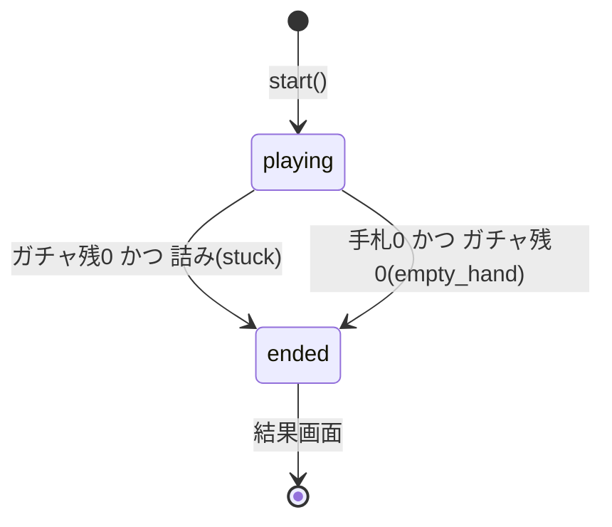

# プロジェクト用語集 (Glossary)

## 概要

このドキュメントは、漢字合体ガチャ（仮称）の全ドキュメント・コードで使用する用語を統一的に定義する**ユビキタス言語**です。実装・仕様・会話で同じ言葉を同じ意味で使うことを目的とします。

**更新日**: 2026-06-02
**対象範囲**: PRD / 機能設計書 / アーキテクチャ設計書 / リポジトリ構造定義書 / 開発ガイドライン

---

## ドメイン用語

プロダクト固有のゲーム概念。

### 部品 (Part)

**定義**: ガチャで引く、漢字を構成する部首・つくりの単位。

**説明**: KRADFILE のラジカルを基盤とし、`id`・表示文字・レアリティ（★1〜★5）・所属レベル・抽選重み（weight）を持つ。プレイヤーは部品を2つ以上組み合わせて漢字を作る。

**関連用語**: [合体](#合体-combine)、[手札](#手札-hand)、[レアリティ](#レアリティ-rarity)、[ガチャ](#ガチャ-gacha)

**データモデル**: `Part`（`src/domain/types.ts`） / `public/data/parts.json`

**英語表記**: Part

### 合体 (Combine)

**定義**: 手札の部品を2つ以上選んで組み合わせ、有効な漢字を成立させる中核アクション。

**説明**: 配置不問（⿰⿱を区別しない）・多部品OK（任意・強制ではない）・複数解OK。判定はアプリ内JSON辞書の検索で行う（[合体判定](#合体判定-combine-resolution)）。成立で[スコア](#スコア計算-score-calculation)加算・部品消費・[図鑑](#図鑑-zukan)追加、不成立は[ミス](#ミス-miss)。

**関連用語**: [部品](#部品-part)、[代表解](#代表解-primary)、[コンボ](#コンボ倍率-combo-multiplier)、[ミス](#ミス-miss)

**使用例**: 「言＋寺＝詩」「木＋木＝林」「木＋壴＋寸＝樹（多部品）」

**実装**: `CombineService`（`src/domain/combine/`）

**英語表記**: Combine

### レベル (Level)

**定義**: 難易度の選択肢。有効辞書の範囲を学年制で切り替える。

**取りうる値**:

| 値 | 表示 | 有効辞書 | 字数目安 |
|---|---|---|---|
| `elementary` | やさしい | 教育漢字（小学校） | 約1,026 |
| `juniorhigh` | ふつう | 中学卒業相当 | 約1,600 |
| `joyo` | むずかしい | 常用漢字 全部 | 2,136 |

**説明**: レベルは「有効辞書範囲・[ガチャプール構成](#ガチャプール構成--床の統計的維持)・[ヒント](#ヒント-hint)開放度・出現率」の組み合わせで難易度を作る。包含関係 `elementary ⊆ juniorhigh ⊆ joyo` を満たす。常用外は[極モード](#極モード-kiwami-mode)（将来）。

**関連用語**: [ガチャプール構成](#ガチャプール構成--床の統計的維持)、[極モード](#極モード-kiwami-mode)

**実装**: `type Level = 'elementary' | 'juniorhigh' | 'joyo'`

### ガチャ (Gacha)

**定義**: ボタン操作で部品を1つ抽選し手札に加える操作。本ゲームの「ガチャ」は**ゲーム機構であり課金ガチャではない**。

**説明**: レベル別の[レアリティ](#レアリティ-rarity)出現率と weight で抽選する（[ガチャ抽選](#ガチャ抽選-gacha-draw)）。1プレイのガチャ回数は固定10回（暫定・要調整）。**有料ガチャは永久に実装しない**（景表法・未成年炎上の回避）。

**関連用語**: [ガチャ残り](#ガチャ残り-gacha-remaining)、[レアリティ](#レアリティ-rarity)、[ガチャプール構成](#ガチャプール構成--床の統計的維持)

**英語表記**: Gacha (capsule-toy)

### ガチャ残り (Gacha Remaining)

**定義**: 1プレイで残っているガチャ回数。0かつ[詰み](#詰み-stuck)で[終了](#ゲームセッションの状態-game-session-state)。

**説明**: [救済](#救済-rescue)（ヒント・捨てて引き直す）のコストはこのガチャ残りを消費する（レベル別 0/-1/-2）。

**実装**: `GameSession.gachaRemaining`

### 手札 (Hand)

**定義**: 現在プレイヤーが保持している部品の集合。合体の対象。

**説明**: 上限は暫定12（要調整）。同一部品を複数枚持てるため、手札内は `HandPart`（instanceId付き）で管理する。上限到達時はUIがガチャボタンを非活性化する。

**関連用語**: [部品](#部品-part)、[手札上限](#手札上限-hand-cap)

**実装**: `GameSession.hand: HandPart[]`

### 手札上限 (Hand Cap)

**定義**: 手札に保持できる部品の最大数。暫定値 `HAND_CAP = 12`（要調整）。

**実装**: `src/domain/constants.ts`

### レアリティ (Rarity)

**定義**: 部品のランク。★1〜★5の5段階。

**説明**: ★5ほど強力（成立する漢字が多い）だが出にくい。レベル別の出現率テーブル（[ガチャ抽選](#ガチャ抽選-gacha-draw)）に従う。演出で★1グレー/★2青/★3緑/★4紫/★5金。

**実装**: `type Rarity = 1 | 2 | 3 | 4 | 5`

### 床の統計的維持 (Floor)

**定義**: 「やさしい」で、手札に必ず作れる2部品の有名漢字が含まれやすいよう[ガチャプール](#ガチャプール構成--床の統計的維持)を構成し、[詰み](#詰み-stuck)を起きにくくする設計思想。

**説明**: 「保証」ではなく**統計的な予防**。能動的な出現率補正は行わず、`Part.weight` の静的設計で詰み率をKPI目標（10〜20%）に寄せる。妥当性は[詰み率シミュレーション](#詰み率シミュレーション-stuck-rate-simulation)で検証する。本ゲームの中核思想「難易度は[ガチャプール](#ガチャプール構成--床の統計的維持)で制御する」の根拠。

**関連用語**: [救済](#救済-rescue)、[詰み](#詰み-stuck)、[ガチャプール構成](#ガチャプール構成--床の統計的維持)

### 代表解 (Primary)

**定義**: 1つの部品組み合わせから複数の漢字が成立する（複数解）とき、採点・図鑑付与の対象として一意に選ぶ1字。

**説明**: 選定ルール `selectPrimary`：①freqRank最小（最も一般的）②同順位なら画数大。**ビルド時の primary とプレイ時の awarded は独立に計算**され、一致しないことがある（scope外を採点しない設計）。例：日＋月＝明/朙 → 採点は「明」。

**関連用語**: [複数解](#複数解--別解-multiple-solutions--alternatives)、[図鑑](#図鑑-zukan)

**実装**: `selectPrimary`（`src/domain/combine/selectPrimary.ts`）

### 複数解 / 別解 (Multiple Solutions / Alternatives)

**定義**: 同一の部品集合から複数の漢字が成立すること。採点される[代表解](#代表解-primary)以外を「別解」と呼ぶ。

**説明**: 別解（scope内）は `altDiscovered` に記録するがMVPでは画面非表示（将来の別解コレクション用にスキーマ予約）。図鑑の収集率分母Nは「到達可能な primary 漢字総数」を用いる。

**実装**: `CombineEntry.results`（配列保持） / `ZukanState.altDiscovered`

### ミス (Miss)

**定義**: 無効な部品組み合わせで合体を試みること。

**説明**: 例外ではなく**正常系の戻り値（`null`）**で扱う。ペナルティは[コンボ](#コンボ倍率-combo-multiplier)リセットのみ（部品は消費しない・重いペナルティにしない）。演出は赤シェイク・✕。

**関連用語**: [合体](#合体-combine)、[コンボ倍率](#コンボ倍率-combo-multiplier)

### コンボ倍率 (Combo Multiplier)

**定義**: 連続成功でスコアに乗算される倍率。暫定 `1.0→1.5→2.0→3.0`（上限3.0・要調整）。

**説明**: [ミス](#ミス-miss)で `1.0` にリセット。上級者の腕の見せ所。

**実装**: `COMBO_STEPS`（`src/domain/constants.ts`） / `ScoreService`

### 救済 (Rescue)

**定義**: 詰まりを打開するための最小限の手段。MVPは**「ヒント」と「捨てて引き直す」の2つだけ**。

**説明**: v1.0企画の3層救済（ピティ天井・相性ボーナス・レスキューガチャ・再振りチケット等）は**廃止**。詰みは[床の統計的維持](#床の統計的維持-floor)で予防する設計に転換した。

**関連用語**: [ヒント](#ヒント-hint)、[捨てて引き直す](#捨てて引き直す-discard-and-draw)、[床の統計的維持](#床の統計的維持-floor)

### ヒント (Hint)

**定義**: 合体できるペアを1組やさしく点滅表示する、常設の親切UI。

**説明**: 「恥ずかしい救済」ではなく学びの瞬間として提供。レベル別：やさ＝無料常時／ふつう＝ガチャ残-1（暫定）／むず＝利用不可。

**実装**: `RescueService.useHint` / `CombineService.findHint`

### 捨てて引き直す (Discard and Draw)

**定義**: 手札の部品を1枚捨て、補充ガチャを1回引く打開操作。

**説明**: (1)削除＋コスト消費 →(2)補充ガチャ の2ステップ。補充は通常のガチャ残を減らさず、レベル別コスト（やさ無料／ふつう-1／むず-2）のみ消費。

**実装**: `RescueService.discardAndDraw`

### 詰み (Stuck)

**定義**: 手札に合体可能な組み合わせが1つも存在しない状態。

**説明**: [ガチャ残り](#ガチャ残り-gacha-remaining)0かつ詰みで[ゲーム終了](#ゲームセッションの状態-game-session-state)（`endReason = 'stuck'`）。KPIの「詰み終了率」目標は10〜20%。判定は[詰み判定](#詰み判定-stuck-detection)。

**関連用語**: [詰み判定](#詰み判定-stuck-detection)、[床の統計的維持](#床の統計的維持-floor)

### 図鑑 (Zukan)

**定義**: 作った漢字を記録・収集するメタ進行機能。継続の核。

**説明**: 各漢字の文字・読み・意味（KANJIDIC2由来）と収集率（○/N）を表示。N＝到達可能な[代表解](#代表解-primary)総数（「2,136」は目安表記）。ローカルストレージに永続保存。

**実装**: `ZukanState`（`src/domain/types.ts`）

**英語表記**: Zukan (illustrated reference book)

### シードデイリー / 今日のお題 (Seeded Daily)

**定義**: 日付をシードにした疑似乱数で、全プレイヤーに同一のガチャ列を提供する日替わりチャレンジ。

**説明**: **サーバー0台**で実現（[mulberry32](#mulberry32) + [dailySeed](#シードアルゴリズム-seeding)）。日付の基準は**JST 0:00固定**。レベルは日替わり固定。グローバルランキングはスコープ外（後期・要BE）。

**関連用語**: [mulberry32](#mulberry32)、[シードアルゴリズム](#シードアルゴリズム-seeding)

### 称号ランク (Rank)

**定義**: 結果画面で表示する、スコア帯に応じたランク（例：見習い／中級／上級／名人）。

**説明**: バックエンドを使わずローカルの固定スコア閾値テーブルで算出。実プレイヤー分布を参照する「上位○%」表記は誤解を招くため使わない。

**実装**: `resolveRank`（`src/domain/rank/resolveRank.ts`）

### 極モード (Kiwami Mode)

**定義**: 常用外の「映える漢字」（龍・鬱・薔薇 等）を解禁する将来モード。

**説明**: MVPは常用漢字で打ち止め（難読によるストレス回避）。バズ素材を別アセット遅延ロードで温存し、MVPコストを増やさない。

**ステータス**: 将来（Post-MVP・F15）

---

## アーキテクチャ用語

### レイヤードアーキテクチャ (Layered Architecture)

**定義**: システムを役割で層分割し、上位→下位の一方向依存に保つ設計パターン。

**本プロジェクトでの適用**: UI→App→Domain／Data の4層。

```
ui/   (Svelte画面・演出)
  ↓
app/  (SessionManager・store)
  ↓
domain/ (純粋ロジック)   data/ (辞書・永続化)
```

**依存ルール**: `ui`→`app`→`domain`/`data`。下位→上位、横断は禁止。`ui`は`domain/types`を型のみ参照可。ESLint `no-restricted-imports`＋`import/no-cycle`で強制。

**参考**: [architecture.md](./architecture.md) / [repository-structure.md](./repository-structure.md)

### ドメイン層の純粋性 (Domain Purity)

**定義**: `src/domain/` を外部依存（UI・ストレージ・グローバル）から切り離し、純粋関数で構成する原則。

**本プロジェクトでの適用**: ドメイン層で `Math.random()`・`Date.now()` を直接呼ばない。乱数・時刻は引数注入する（[RNG注入](#rng注入-rng-injection)）。ESLint `no-restricted-syntax`（ASTセレクタ）でCI強制。

**メリット**: [シードデイリー](#シードデイリー--今日のお題-seeded-daily)の決定論的再現とユニットテストの容易性。

### RNG注入 (RNG Injection)

**定義**: 乱数生成器を引数で渡す依存性注入パターン。

**本プロジェクトでの適用**: ドメインは `Rng` インターフェース型のみ受け取る。生成・注入はアプリ層（`SessionManager.start`）：フリー＝`() => Math.random()`、デイリー＝`mulberry32(dailySeed(todayYmdJst(Date.now())))`。`mulberry32`はドメイン、`Math.random`ラップはアプリに置く。

### クライアント完結 (Client-only)

**定義**: ゲームプレイがブラウザ内で完結し、サーバー通信を持たない構成。

**本プロジェクトでの適用**: 漢字判定はアプリ内JSON辞書で完結。バックエンド0台・運用費0円・外部送信なし。攻撃面・プライバシー面を持たない。

### ガチャプール構成 / 床の統計的維持

→ [床の統計的維持](#床の統計的維持-floor) を参照。「難易度はガチャの中身（プール構成）で作る」という本ゲームの中核設計思想。

---

## 技術用語

### TypeScript

**定義**: JavaScriptに静的型付けを加えた言語。

**本プロジェクトでの用途**: 全ソースコード。機能設計のドメイン型を直接実装。

**バージョン**: 5.x ／ **設定**: `tsconfig.json`（実行時src用）, `tsconfig.scripts.json`（ビルドスクリプト用）

### Svelte

**定義**: コンパイル時にフレームワークコードを消し去るUIフレームワーク。

**公式**: https://svelte.dev/ ／ **バージョン**: 5.x（runes：`$state`/`$derived`/`$effect`/`$props`）

**本プロジェクトでの用途**: UI層・状態管理（store）。**選定理由**: 極小バンドル・低保守コスト。**代替案**: React/Preact（仮想DOMで重い）、Vanilla（冗長）。

### Vite

**定義**: 高速な開発サーバー・バンドラ。

**本プロジェクトでの用途**: ビルド・開発サーバー・静的出力。`vite-plugin-pwa`でSWプリキャッシュ（オフライン）。**バージョン**: 5.x

### Vitest

**定義**: Viteベースのテストランナー。

**本プロジェクトでの用途**: ユニット・統合テスト。ドメイン層カバレッジ90%を per-directory thresholds で強制。

### Playwright

**定義**: ブラウザ自動化のE2Eテストツール。

**本プロジェクトでの用途**: 基本プレイ・[シードデイリー](#シードデイリー--今日のお題-seeded-daily)再現性の検証。CIでは `npx playwright install --with-deps` が必要。

### Capacitor

**定義**: WebアプリをネイティブアプリにラップしApp Store/Play配信を可能にするフレームワーク。

**本プロジェクトでの用途**: **将来**のネイティブ化。Web資産を再利用し、プラグインで報酬型広告（AdMob）・買い切り（IAP）を接続。PWA化を先行、Capacitorはストア配信時に導入。

### KANJIDIC2

**定義**: 漢字のメタデータ（読み・意味・画数・JIS区分）辞書。

**ライセンス**: CC BY-SA 4.0（EDRDG）／ **用途**: `kanji.json` 生成元。画数は[スコア](#スコア計算-score-calculation)の基礎点。

### KRADFILE

**定義**: 漢字を構成部品（ラジカル）に分解する辞書。

**ライセンス**: CC BY-SA 4.0（EDRDG）／ **用途**: [合体辞書](#合体辞書-combine-dictionary)（`combine-dict.json`）生成元。分解深さは1段階に統一。

### mulberry32

**定義**: シード値から決定的な疑似乱数列を生成する軽量PRNG。

**本プロジェクトでの用途**: [シードデイリー](#シードデイリー--今日のお題-seeded-daily)で「全員同一ガチャ列」を再現。同一シード→同一乱数列。

**実装**: `src/domain/rng/mulberry32.ts`

---

## 略語・頭字語

| 略語 | 正式名称 | 本プロジェクトでの意味 |
|---|---|---|
| PRD | Product Requirements Document | プロダクト要求定義書（`docs/product-requirements.md`） |
| MVP | Minimum Viable Product | 最初に出すWeb版の最小機能（F1〜F10） |
| PWA | Progressive Web App | SWでオフライン・ホーム追加を可能にするWeb技術 |
| SW | Service Worker | アセットをキャッシュしオフライン動作を担うブラウザ機構 |
| RNG | Random Number Generator | 乱数生成器（[RNG注入](#rng注入-rng-injection)） |
| CSP | Content-Security-Policy | 外部リソースを制限するセキュリティヘッダ |
| CC BY-SA | Creative Commons Attribution-ShareAlike | 表示・継承義務のあるライセンス（辞書データ） |
| IAP | In-App Purchase | アプリ内課金（将来の買い切り） |
| DAU | Daily Active Users | 日次アクティブユーザー数（KPI） |
| KPI | Key Performance Indicator | 重要業績評価指標 |
| AST | Abstract Syntax Tree | 抽象構文木（ESLint `no-restricted-syntax`が走査） |
| BE | Backend | バックエンド（MVPは無し） |

---

## ゲームセッションの状態 (Game Session State)

**定義**: 1プレイの進行状態。

**フェーズ**:

| 値 | 意味 | 遷移 |
|---|---|---|
| `playing` | プレイ中 | 終了条件成立で `ended` へ |
| `ended` | 終了 | 結果画面へ |

**終了理由 (endReason)**:

| 値 | 意味 | KPI上の扱い |
|---|---|---|
| `stuck` | ガチャ残0かつ[詰み](#詰み-stuck)（条件 a+b の AND） | 「詰み終了」としてカウント |
| `empty_hand` | 手札0かつガチャ残0 | 別カウント |

**状態遷移図**:



**実装**: `GameSession.phase` / `PlayStats.endReason`（`src/domain/types.ts`）

---

## データモデル用語

### Part（部品マスタ）
`id` / `char` / `rarity` / `scopes`（所属レベル）/ `weight`（抽選重み）。→ [部品](#部品-part)

### KanjiEntry（漢字マスタ）
`char` / `strokes`（画数=スコア基礎）/ `readings` / `meanings` / `level` / `freqRank`。出典 KANJIDIC2。

### CombineEntry（合体辞書エントリ）
`key`（部品idマルチセットの正規化）/ `results`（複数解の配列）/ `primary`（[代表解](#代表解-primary)）/ `partCount`。→ [合体辞書](#合体辞書-combine-dictionary)

### GameSession（実行時セッション）
`level` / `mode`（free|daily）/ `seed` / `gachaRemaining` / `hand` / `score` / `phase` / `stats`。メモリ保持。

### ZukanState（図鑑）
`discovered`（char→初回日時・回数）/ `altDiscovered`（別解・予約）。→ [図鑑](#図鑑-zukan)

### PersistedState（永続データ）
`zukan` / `bestScores` / `dailyBest` / `settings` / `schemaVersion`（現在1）。localStorage単一キー `kg.state.v1`。

### 合体辞書 (Combine Dictionary)
**定義**: 「部品の組み合わせ→漢字」のマッピング（`combine-dict.json`）。KRADFILEから生成。**key** は部品idのマルチセットを昇順ソートして連結（配置不問）。複数漢字は `results` 配列に集約。**自作データだがCC BY-SA継承**で公開。

---

## エラー・例外

### DictionaryLoadError
**発生条件**: 辞書JSONのロード失敗。**対処**: 起動中断＋リトライ導線。表示「データの読み込みに失敗しました。再読み込みしてください」。

### StorageUnavailableError
**発生条件**: localStorageが利用不可/容量超過。**対処**: メモリ動作で継続、保存系のみ無効化。表示「記録を保存できない設定です。今回の図鑑は保存されません」。

> ゲームロジックの[ミス](#ミス-miss)（無効合体）は**例外ではなく**正常系の戻り値（`null`）で扱う。例外はインフラ的失敗にのみ使う。

---

## 計算・アルゴリズム

### スコア計算 (Score Calculation)
**式**: `加点 = floor(画数 × 基礎係数1) × コンボ倍率`。画数ベースで難字ほど高得点（自己バランス）。
**実装**: `ScoreService`（`src/domain/score/`）

### ガチャ抽選 (Gacha Draw)
**手順**: ①レベル別出現率で[レアリティ](#レアリティ-rarity)抽選 →②当該レアリティ・レベルの部品から `weight` 重み付き抽選。weightで[床の統計的維持](#床の統計的維持-floor)を担う。
**実装**: `GachaService.draw`

### 合体判定 (Combine Resolution)
**手順**: 選択部品を `makeKey`（昇順ソート連結）→辞書 `Map` 検索（O(1)）→scope内の成立漢字に `selectPrimary` を適用し `awarded` 確定。不成立は `null`。
**実装**: `resolveCombine`（`src/domain/combine/`）

### 詰み判定 (Stuck Detection)
**定義**: 手札の組み合わせ（サイズ2〜`MAX_COMBINE_PARTS`）を辞書総当たりし、合体可能解の有無を判定（早期return）。
**用途**: [終了判定](#ゲームセッションの状態-game-session-state)と[ヒント](#ヒント-hint)で共用。
**実装**: `canCombineAny` / `findHint`

### シードアルゴリズム (Seeding)
**定義**: `todayYmdJst(nowMs)`（JST固定でYYYYMMDD）→ `dailySeed`（整数化）→ `mulberry32(seed)` で決定的乱数列。
**用途**: [シードデイリー](#シードデイリー--今日のお題-seeded-daily)の全員同一再現。

### 詰み率シミュレーション (Stuck-rate Simulation)
**定義**: 各レベルのプール・出現率・weightで耐久10回プレイをモンテカルロ実行し、[詰み](#詰み-stuck)終了率を実測する**ビルド時検証**。
**用途**: KPI目標（10〜20%）に収めるweight調整。CIの品質ゲート（失敗でマージ不可）。
**実装**: `scripts/build-data/simulateStuckRate.ts`

---

## 索引

### あ行
- [合体](#合体-combine) — ドメイン
- [合体辞書](#合体辞書-combine-dictionary) — データモデル
- [合体判定](#合体判定-combine-resolution) — アルゴリズム
- [今日のお題](#シードデイリー--今日のお題-seeded-daily) — ドメイン

### か行
- [ガチャ](#ガチャ-gacha) / [ガチャ残り](#ガチャ残り-gacha-remaining) / [ガチャ抽選](#ガチャ抽選-gacha-draw)
- [極モード](#極モード-kiwami-mode) — ドメイン（将来）
- [救済](#救済-rescue) — ドメイン
- [クライアント完結](#クライアント完結-client-only) — アーキテクチャ
- [コンボ倍率](#コンボ倍率-combo-multiplier) — ドメイン

### さ行
- [シードデイリー](#シードデイリー--今日のお題-seeded-daily) / [シードアルゴリズム](#シードアルゴリズム-seeding)
- [称号ランク](#称号ランク-rank) — ドメイン
- [スコア計算](#スコア計算-score-calculation) — アルゴリズム
- [捨てて引き直す](#捨てて引き直す-discard-and-draw) — ドメイン

### た行
- [代表解](#代表解-primary) — ドメイン
- [詰み](#詰み-stuck) / [詰み判定](#詰み判定-stuck-detection) / [詰み率シミュレーション](#詰み率シミュレーション-stuck-rate-simulation)
- [手札](#手札-hand) / [手札上限](#手札上限-hand-cap)
- [ドメイン層の純粋性](#ドメイン層の純粋性-domain-purity) — アーキテクチャ

### は行
- [図鑑](#図鑑-zukan) — ドメイン
- [部品](#部品-part) — ドメイン
- [複数解 / 別解](#複数解--別解-multiple-solutions--alternatives) — ドメイン
- [床の統計的維持](#床の統計的維持-floor) — ドメイン/アーキテクチャ

### ま行
- [ミス](#ミス-miss) — ドメイン
- [mulberry32](#mulberry32) — 技術

### や行
- [指定レベル](#レベル-level) → レベル

### ら行
- [ランク](#称号ランク-rank) / [レアリティ](#レアリティ-rarity) / [レベル](#レベル-level)
- [レイヤードアーキテクチャ](#レイヤードアーキテクチャ-layered-architecture) — アーキテクチャ
- [RNG注入](#rng注入-rng-injection) — アーキテクチャ

### A-Z
- [Capacitor](#capacitor) / [KANJIDIC2](#kanjidic2) / [KRADFILE](#kradfile) / [Playwright](#playwright) / [Svelte](#svelte) / [TypeScript](#typescript) / [Vite](#vite) / [Vitest](#vitest)
- 略語：[PRD](#略語頭字語) / MVP / PWA / SW / RNG / CSP / CC BY-SA / IAP / DAU / KPI / AST / BE

---

## 変更履歴

| 日付 | 変更 |
|---|---|
| 2026-06-02 | 初版作成（5ドキュメントから用語抽出） |
