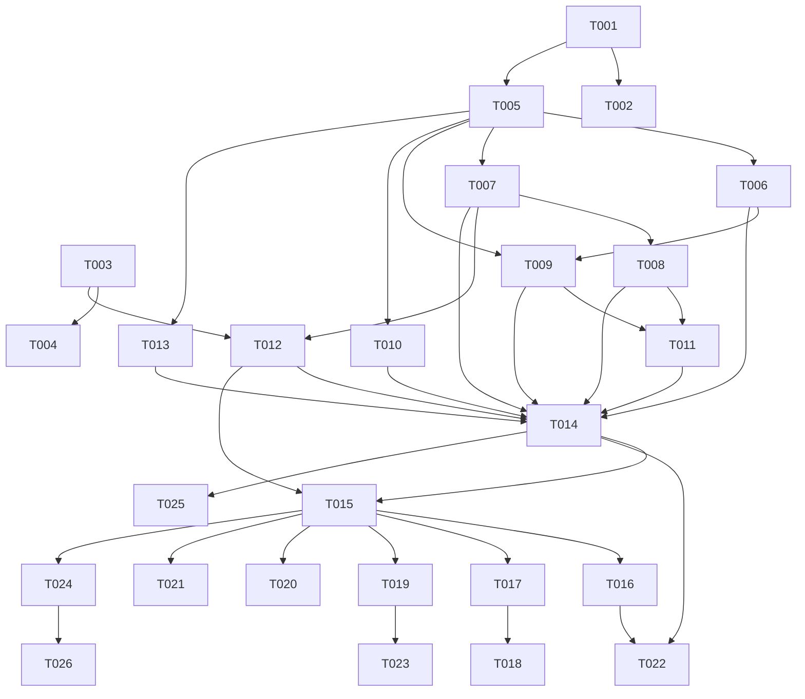

# 開発チケット索引

漢字合体ガチャ（仮称）の実装チケット一覧。下位レイヤー（純粋ロジック）から上へ積む順序でフェーズ分けする。

**上流ドキュメント**：[PRD](../product-requirements.md) / [機能設計](../functional-design.md) / [アーキテクチャ](../architecture.md) / [リポジトリ構造](../repository-structure.md) / [開発ガイドライン](../development-guidelines.md) / [用語集](../glossary.md)

**運用**：1チケット＝1PR相当。着手時に `状態` を 🔲→🏗️、完了で✅。実装は `Skill('steering')` でステアリングファイルを併用してよい。

---

## フェーズ一覧

| Phase | 目的 | チケット |
|---|---|---|
| 0 | 基盤構築 | T-001〜T-004 |
| 1 | ドメインコア（純粋ロジック・TDD） | T-005〜T-011 |
| 2 | データ層・アプリ層 | T-012〜T-014 |
| 3 | UI・画面・演出 | T-015〜T-021 |
| 4 | 機能統合 | T-022〜T-023 |
| 5 | PWA・品質・リリース | T-024〜T-026 |

## チケット一覧

| ID | タイトル | Phase | 優先 | 依存 | PRD | 状態 |
|---|---|---|---|---|---|---|
| [T-001](./T-001-project-scaffold.md) | プロジェクトscaffold | 0 | P0 | — | — | ✅ |
| [T-002](./T-002-quality-ci.md) | 品質ツール・CIパイプライン | 0 | P0 | — | — | 🔲 |
| [T-003](./T-003-data-generation.md) | データ生成パイプライン | 0 | P0 | — | F2 | 🔲 |
| [T-004](./T-004-data-verification.md) | データ検証ゲート | 0 | P0 | T-003 | — | 🔲 |
| [T-005](./T-005-domain-types-constants.md) | ドメイン型＋定数 | 1 | P0 | T-001 | — | 🔲 |
| [T-006](./T-006-rng.md) | RNG（mulberry32・dailySeed） | 1 | P0 | T-005 | F8 | ✅ |
| [T-007](./T-007-combine-engine.md) | 合体エンジン | 1 | P0 | T-005 | F2 | 🔲 |
| [T-008](./T-008-stuck-hint.md) | 詰み判定・ヒント探索 | 1 | P0 | T-007 | F5,F6 | ✅ |
| [T-009](./T-009-gacha-draw.md) | ガチャ抽選 | 1 | P0 | T-005,T-006 | F1 | ✅ |
| [T-010](./T-010-score-rank.md) | スコア・コンボ・称号 | 1 | P0 | T-005 | F4,F6 | ✅ |
| [T-011](./T-011-rescue.md) | 救済（ヒント・捨てて引き直す） | 1 | P0 | T-008,T-009 | F5 | ✅ |
| [T-012](./T-012-dictionary-repository.md) | DictionaryRepository | 2 | P0 | T-003,T-007 | — | ✅ |
| [T-013](./T-013-storage-repository.md) | StorageRepository＋migration | 2 | P0 | T-005 | F7,F9 | ✅ |
| [T-014](./T-014-session-manager.md) | SessionManager＋store | 2 | P0 | T-006〜T-013 | F1〜F6 | ✅ |
| [T-015](./T-015-app-shell.md) | アプリシェル・画面遷移 | 3 | P0 | T-012,T-014 | — | ✅ |
| [T-016](./T-016-home-screen.md) | Home画面 | 3 | P0 | T-015 | F3,F9 | ✅ |
| [T-017](./T-017-game-screen.md) | Game画面 | 3 | P0 | T-015 | F1,F2,F4,F5 | ✅ |
| [T-018](./T-018-effects.md) | 演出（Canvas・CSS） | 3 | P0 | T-017 | F1,F2 | ✅ |
| [T-019](./T-019-result-screen.md) | Result画面 | 3 | P0 | T-015 | F6,F9 | ✅ |
| [T-020](./T-020-zukan-screen.md) | Zukan画面 | 3 | P0 | T-013,T-015 | F7 | ✅ |
| [T-021](./T-021-about-license.md) | About画面・クレジット | 3 | P0 | T-015 | F10 | 🔲 |
| [T-022](./T-022-seeded-daily.md) | シードデイリー統合 | 4 | P0 | T-014,T-016 | F8 | 🔲 |
| [T-023](./T-023-result-share.md) | 結果シェア | 4 | P1 | T-019 | F11 | 🔲 |
| [T-024](./T-024-pwa-offline.md) | 最小SW・PWA（オフライン保証） | 5 | P0 | T-015 | — | 🔲 |
| [T-025](./T-025-e2e-quality-gate.md) | E2E・品質ゲート仕上げ | 5 | P0 | T-014〜T-022 | — | 🔲 |
| [T-026](./T-026-deploy.md) | 静的デプロイ・CSP | 5 | P0 | T-024 | — | 🔲 |

## 依存グラフ（概略）

## 状態の凡例
🔲 未着手 ／ 🏗️ 着手中 ／ 🔬 レビュー中 ／ ✅ 完了
