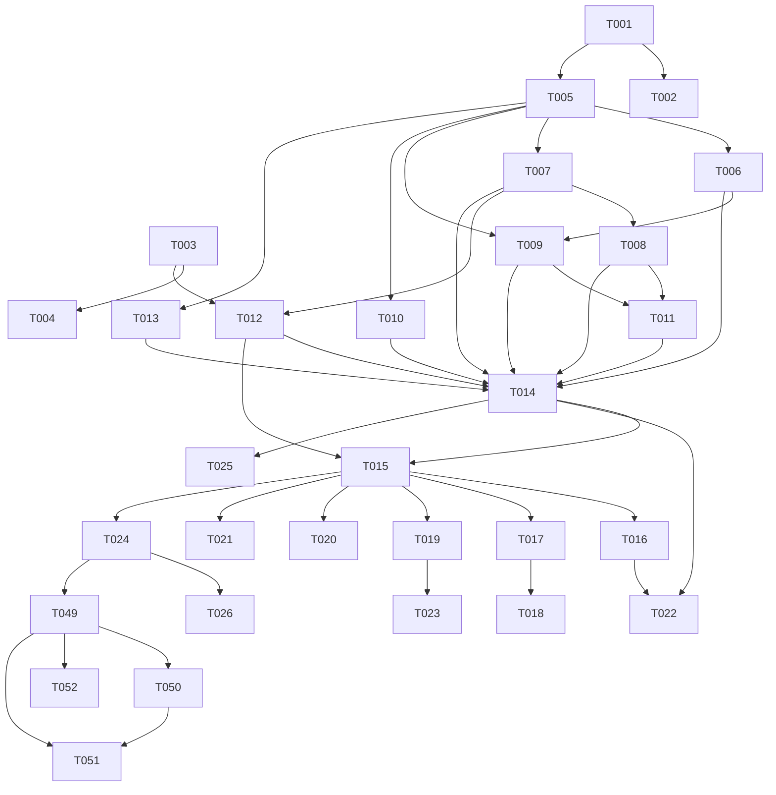

# 開発チケット索引

漢字合体ガチャ（仮称）の実装チケット一覧。下位レイヤー（純粋ロジック）から上へ積む順序でフェーズ分けする。

**上流ドキュメント**：[PRD](../product-requirements.md) / [機能設計](../functional-design.md) / [アーキテクチャ](../architecture.md) / [リポジトリ構造](../repository-structure.md) / [開発ガイドライン](../development-guidelines.md) / [用語集](../glossary.md)

**運用**：1チケット＝1PR相当。着手時に `状態` を 🔲→🏗️、完了で✅。実装は `Skill('steering')` でステアリングファイルを併用してよい。

---

## フェーズ一覧

| Phase | 目的 | チケット |
|---|---|---|
| 0 | 基盤構築 | T-001〜T-004 |
| 1 | ドメインコア（純粋ロジック・TDD） | T-005〜T-011 |
| 2 | データ層・アプリ層 | T-012〜T-014 |
| 3 | UI・画面・演出 | T-015〜T-021 |
| 4 | 機能統合 | T-022〜T-023 |
| 5 | PWA・品質・リリース | T-024〜T-026 |
| 6 | 追加機能 | T-027 |
| 7 | レベル・学習拡張 | T-028〜T-048 |
| 8 | プラットフォーム掲載（fujioha_platform スポーク化） | T-049〜T-052 |

## チケット一覧

| ID | タイトル | Phase | 優先 | 依存 | PRD | 状態 |
|---|---|---|---|---|---|---|
| [T-001](./T-001-project-scaffold.md) | プロジェクトscaffold | 0 | P0 | — | — | ✅ |
| [T-002](./T-002-quality-ci.md) | 品質ツール・CIパイプライン | 0 | P0 | — | — | ✅ |
| [T-003](./T-003-data-generation.md) | データ生成パイプライン | 0 | P0 | — | F2 | ✅ |
| [T-004](./T-004-data-verification.md) | データ検証ゲート | 0 | P0 | T-003 | — | ✅ |
| [T-005](./T-005-domain-types-constants.md) | ドメイン型＋定数 | 1 | P0 | T-001 | — | ✅ |
| [T-006](./T-006-rng.md) | RNG（mulberry32・dailySeed） | 1 | P0 | T-005 | F8 | ✅ |
| [T-007](./T-007-combine-engine.md) | 合体エンジン | 1 | P0 | T-005 | F2 | ✅ |
| [T-008](./T-008-stuck-hint.md) | 詰み判定・ヒント探索 | 1 | P0 | T-007 | F5,F6 | ✅ |
| [T-009](./T-009-gacha-draw.md) | ガチャ抽選 | 1 | P0 | T-005,T-006 | F1 | ✅ |
| [T-010](./T-010-score-rank.md) | スコア・コンボ・称号 | 1 | P0 | T-005 | F4,F6 | ✅ |
| [T-011](./T-011-rescue.md) | 救済（ヒント・捨てて引き直す） | 1 | P0 | T-008,T-009 | F5 | ✅ |
| [T-012](./T-012-dictionary-repository.md) | DictionaryRepository | 2 | P0 | T-003,T-007 | — | ✅ |
| [T-013](./T-013-storage-repository.md) | StorageRepository＋migration | 2 | P0 | T-005 | F7,F9 | ✅ |
| [T-014](./T-014-session-manager.md) | SessionManager＋store | 2 | P0 | T-006〜T-013 | F1〜F6 | ✅ |
| [T-015](./T-015-app-shell.md) | アプリシェル・画面遷移 | 3 | P0 | T-012,T-014 | — | ✅ |
| [T-016](./T-016-home-screen.md) | Home画面 | 3 | P0 | T-015 | F3,F9 | ✅ |
| [T-017](./T-017-game-screen.md) | Game画面 | 3 | P0 | T-015 | F1,F2,F4,F5 | ✅ |
| [T-018](./T-018-effects.md) | 演出（Canvas・CSS） | 3 | P0 | T-017 | F1,F2 | ✅ |
| [T-019](./T-019-result-screen.md) | Result画面 | 3 | P0 | T-015 | F6,F9 | ✅ |
| [T-020](./T-020-zukan-screen.md) | Zukan画面 | 3 | P0 | T-013,T-015 | F7 | ✅ |
| [T-021](./T-021-about-license.md) | About画面・クレジット | 3 | P0 | T-015 | F10 | ✅ |
| [T-022](./T-022-seeded-daily.md) | シードデイリー統合 | 4 | P0 | T-014,T-016 | F8 | ✅ |
| [T-023](./T-023-result-share.md) | 結果シェア | 4 | P1 | T-019 | F11 | ✅ |
| [T-024](./T-024-pwa-offline.md) | 最小SW・PWA（オフライン保証） | 5 | P0 | T-015 | — | ✅ |
| [T-025](./T-025-e2e-quality-gate.md) | E2E・品質ゲート仕上げ | 5 | P0 | T-014〜T-022 | — | ✅ |
| [T-026](./T-026-deploy.md) | 静的デプロイ・CSP | 5 | P0 | T-024 | — | 🔬 |
| [T-027](./T-027-time-attack-mode.md) | タイムアタックモード | 6 | P1 | T-010,T-014,T-016,T-017,T-019 | F3,F4,F6 | ✅ |
| [T-028](./T-028-grade-split-adult-mode.md) | レベル再編（学年分割・大人モード・名称変更） | 7 | P1 | T-027 | — | ✅ |
| [T-029](./T-029-deck-rules-extension.md) | 達成型ルール拡張（出題数・重複禁止・引き直し返却） | 7 | P1 | T-028 | — | ✅ |
| [T-030](./T-030-combine-study-card.md) | 合体成功時の学習カード（読み/意味/画数＋筆順） | 7 | P1 | T-018 | — | ✅ |
| [T-031](./T-031-furigana-toggle.md) | ふりがな表示トグル | 7 | P1 | — | — | ✅ |
| [T-032](./T-032-tts-readings.md) | 読み上げ（音声・Web Speech） | 7 | P1 | T-030 | — | ✅ |
| [T-033](./T-033-staged-hint.md) | 段階ヒント（光る→読み→答え） | 7 | P1 | T-011 | F5 | ✅ |
| [T-034](./T-034-tutorial.md) | 初回チュートリアル | 7 | P1 | — | — | ✅ |
| [T-035](./T-035-review-mode-srs.md) | にがて漢字＆復習モード（簡易SRS） | 7 | P1 | T-029,T-013 | F7 | ✅ |
| [T-036](./T-036-zukan-study-book.md) | 図鑑の学習帳化（読み/意味/部首・学年別収集率） | 7 | P1 | T-020,T-028 | F7 | 🔬 |
| [T-037](./T-037-accessibility.md) | アクセシビリティ（大きな文字・色覚配慮） | 7 | P1 | — | — | ✅ |
| [T-038](./T-038-achievements-badges.md) | 実績・バッジ／学年マスター称号 | 7 | P2 | T-013,T-028 | — | 🔲 |
| [T-039](./T-039-streak.md) | 連続プレイ日数（ストリーク） | 7 | P2 | T-013 | — | 🔲 |
| [T-040](./T-040-missions.md) | ミッション／お題 | 7 | P2 | T-029 | — | 🔲 |
| [T-041](./T-041-sound-bgm.md) | 効果音・BGM（和風） | 7 | P2 | — | — | 🔲 |
| [T-042](./T-042-print-export.md) | にがて漢字／図鑑のプリント出力 | 7 | P2 | T-035,T-036 | — | 🔲 |
| [T-043](./T-043-guardian-mode.md) | 保護者／先生モード＋学習ログ | 7 | P2 | T-013 | — | 🔲 |
| [T-044](./T-044-haptics.md) | ハプティクス（振動） | 7 | P2 | — | — | 🔲 |
| [T-045](./T-045-radical-origin.md) | 部首名・成り立ち解説 | 7 | P3 | データ追加 | — | 🔲 |
| [T-046](./T-046-vocabulary-examples.md) | 熟語・例文 | 7 | P3 | データ追加 | — | 🔲 |
| [T-047](./T-047-writing-trace.md) | 書き取りトレース採点 | 7 | P3 | 筆順データ拡充 | — | 🔲 |
| [T-048](./T-048-reading-quiz.md) | 読みクイズ／意味当て | 7 | P2 | T-030 | — | 🔲 |
| [T-049](./T-049-cloudflare-spoke-deploy.md) | Cloudflare Pages スポーク配信への再構築 | 8 | P0 | T-024 | — | 🔲 |
| [T-050](./T-050-listing-seo-meta.md) | 掲載向け SEO/OGP/メタ整備 | 8 | P1 | T-049 | — | 🔲 |
| [T-051](./T-051-platform-registry.md) | プラットフォームレジストリ登録（kanji-gattai） | 8 | P0 | T-049,T-050 | — | 🔲 |
| [T-052](./T-052-brand-consistency.md) | ブランド一貫性（@fujioha/ui 取り込み） | 8 | P2 | T-049 | — | 🔲 |

## 依存グラフ（概略）

## 状態の凡例
🔲 未着手 ／ 🏗️ 着手中 ／ 🔬 レビュー中 ／ ✅ 完了
